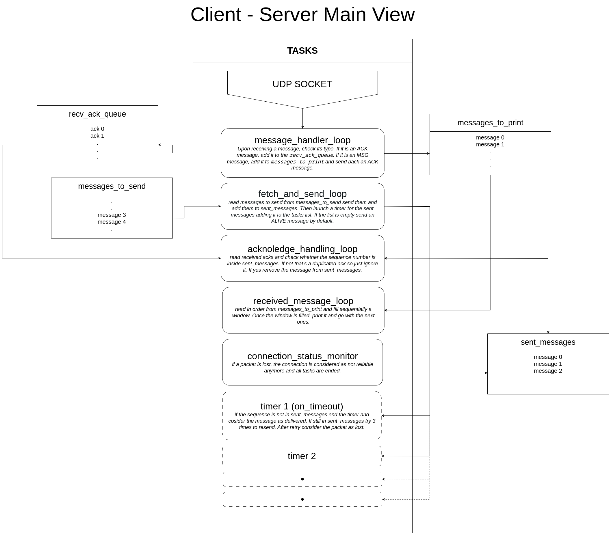

# Asynchronous Client-Server communication [in development]

- Rust

# Build and run:
to compile and run client and server in a separate docker please use:
```
cargo build; cargo run --bin udp-client
cargo build; cargo run --bin udp-server
```

# Arch drawing:


###### Improvements : 
[still in development]